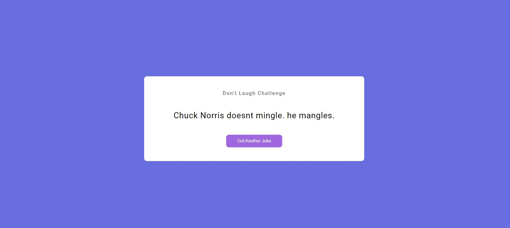

# **JavaScript Mini Project 3 - Jokes Generator**

- This project is a Jokes Generator app.

[Netlify Link](https://jokes-generator-harshcodes.netlify.app/)

---

### **What did I learn from this Project?**

- DOM
- async await
- Event listener

---

### **How much time did it take to build this project?**

- It took me about 1 hour to make. Definitely learnt a lot of new things.

---

## **About me**

#### **Hey, I'm Harsh Thakkar**

- I'm 23 and I live in Thane, Maharashtra. I'm pursuing Full Stack Web Development.

---

## **Feedback**
- Feedbacks are always appreciated. harsh.thakkar1011@gmail.com
